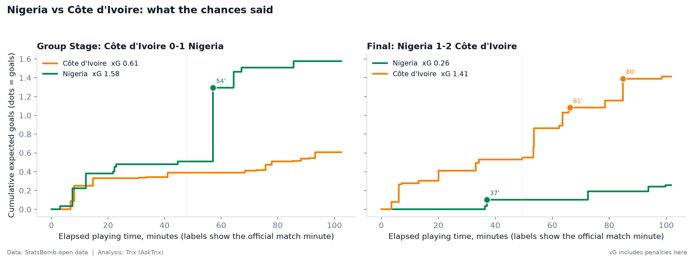
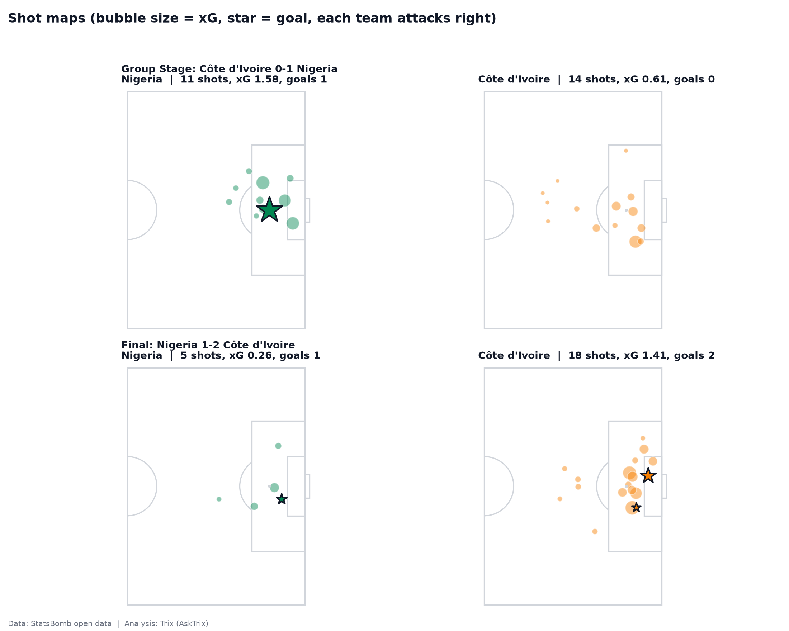
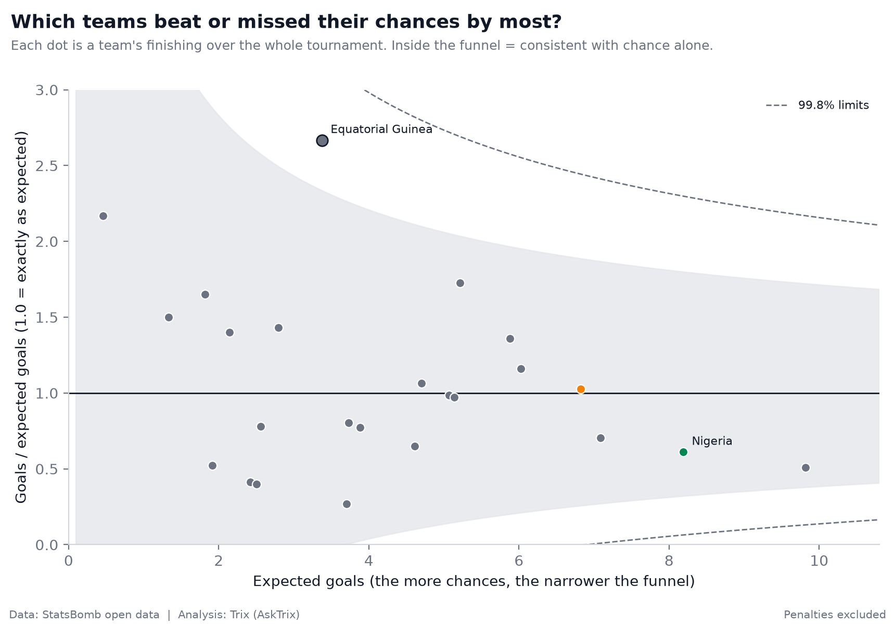
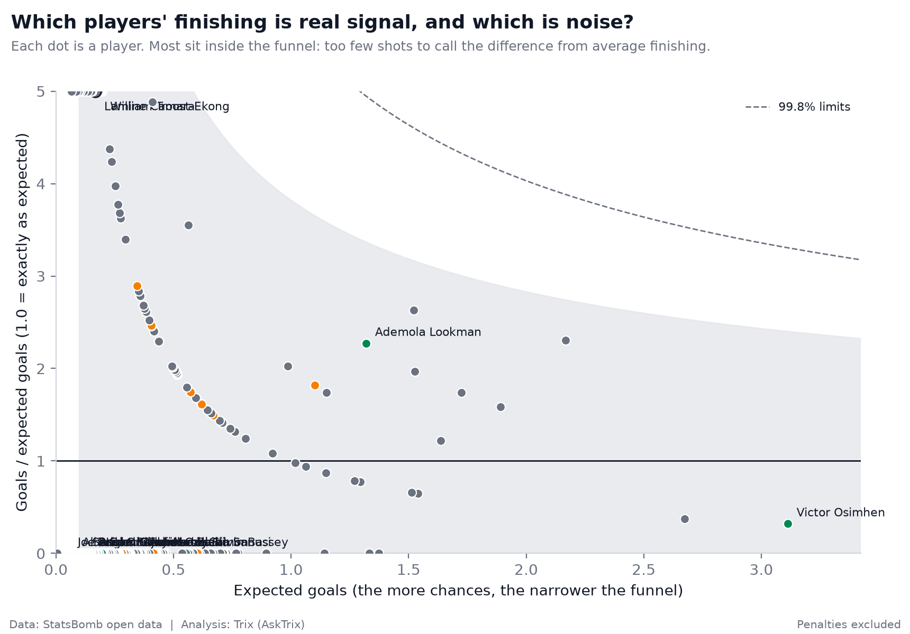
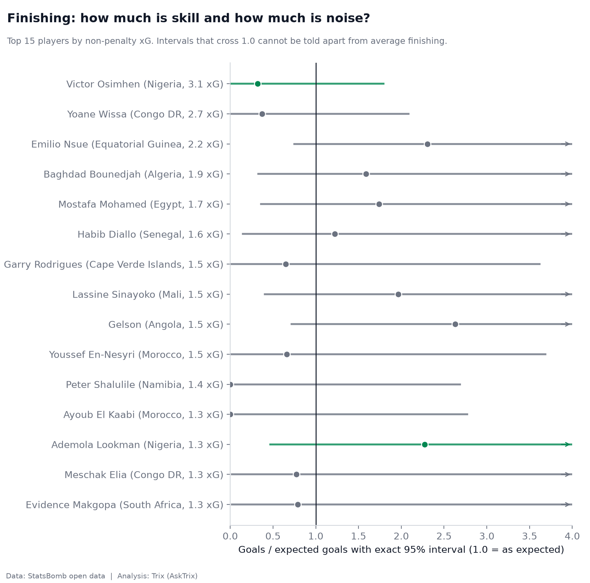
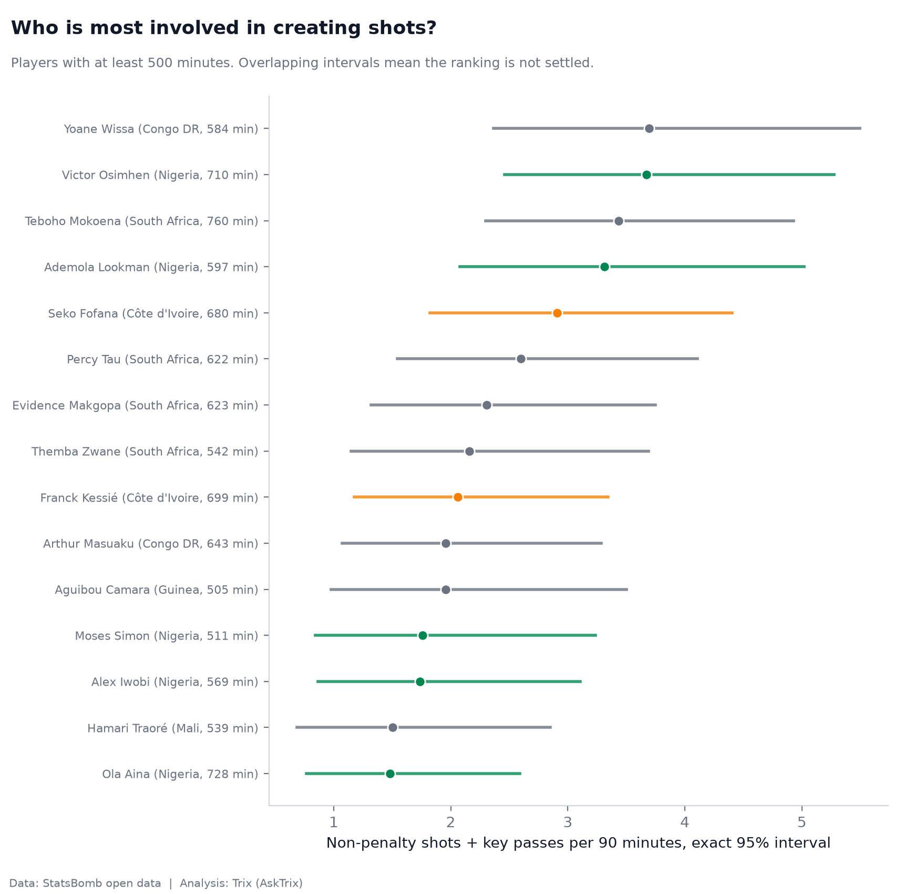
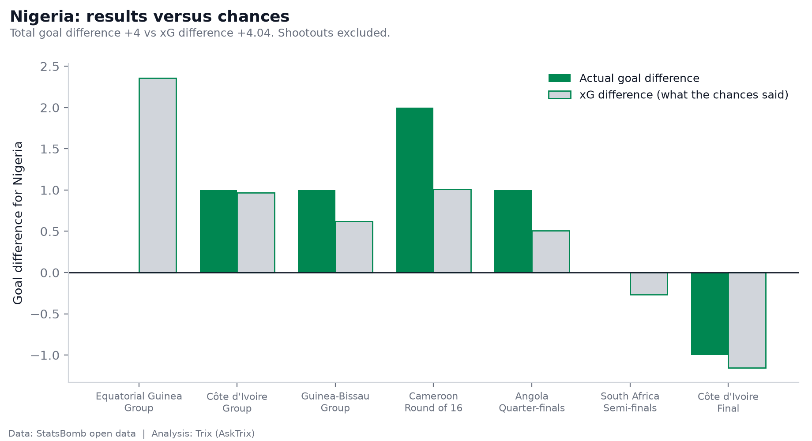

# Signal or Noise? What AFCON 2023 Really Tells Us About Nigeria and Africa's Best Players

> An event-level football analytics project using StatsBomb open data to examine expected goals, finishing, player involvement, and Nigeria's AFCON 2023 tournament run.

   

---

## Why I Built This

Football results can be misleading.

A team can win without creating the better chances. A striker can score more goals than expected without necessarily being an elite finisher. A strong tournament run can also contain a significant amount of randomness.

So instead of asking only:

> **Who won?**

This project asks:

> **What does the underlying data actually support?**

Using event-level StatsBomb data from AFCON 2023, I built an end-to-end analytical pipeline to examine the difference between observable results and the quality of chances behind those results.

The project combines data engineering, statistical analysis, uncertainty estimation, visualization, and Power BI-ready analytical outputs.

---

## The Short Answer

| Level | Verdict | Evidence |
|---|---|---|
| **Nigeria's tournament run** | Mostly **signal** | Actual goal difference **+4** vs xG difference **+4.04** across seven matches |
| **Team finishing** | Mostly **noise** | Only 1 team (Equatorial Guinea) sits outside the 95% funnel |
| **Individual finishing** | Almost entirely **noise** | 328 of 329 players are consistent with chance. The one exception had 288 minutes and 2 goals |
| **Shot involvement ranking** | **Not settled** | The top 5 players' 95% intervals overlap heavily |

---

## The Five Questions

### 1. Did Nigeria create better chances than Côte d'Ivoire?

The first analysis compares Nigeria and Côte d'Ivoire at the match level using:

- Expected goals (xG)
- Non-penalty expected goals (npxG)
- Shots
- Shot quality
- Match-by-match chance creation

The goal is to separate the final scoreline from the underlying quality of the chances created.

| Match | Result | Shots (NGA – CIV) | xG (NGA – CIV) | npxG (NGA – CIV) |
|---|---|---|---|---|
| Group Stage | Nigeria 1–0 Côte d'Ivoire | 11 – 14 | 1.58 – 0.61 | 0.79 – 0.61 |
| Final | Côte d'Ivoire 2–1 Nigeria | 5 – 18 | 0.26 – 1.41 | 0.26 – 1.41 |

**What it says:** In the group stage, Nigeria's xG lead (1.58 to 0.61) was inflated by a penalty worth about 0.78 xG. Without it, the gap shrinks to 0.79 vs 0.61, and Côte d'Ivoire actually had more shots. The final was not close. Côte d'Ivoire took 18 shots to Nigeria's 5 and created more than five times the xG, so the 2–1 scoreline fairly reflects who had the better chances.




---

### 2. Which AFCON 2023 teams finished above or below expectation?

Team finishing is evaluated using goals against expected goals.

Rather than simply ranking teams by:

```text
Goals - xG
```

each team's non-penalty goals are compared with its non-penalty xG as a **ratio** (goals ÷ xG), with an exact Poisson 95% confidence interval and a funnel plot. A team is only called an over- or under-performer if it falls **outside** the funnel. That is, if the gap is bigger than chance alone would normally produce for that number of chances.

**What it says:** Only one team falls outside the 95% funnel: **Equatorial Guinea**, with 9 non-penalty goals from 3.37 xG (ratio 2.67, 95% CI 1.22–5.06). They did not breach the stricter 99.8% limits. With 24 teams tested at the 95% level, roughly one outlier is what chance alone would produce, so even this result should be read cautiously. Nigeria sits below 1.0 (roughly 0.6 on the chart) but comfortably inside the funnel, meaning its modest conversion rate cannot be separated from bad luck.



---

### 3. Which players are genuinely clinical finishers, and which are just running hot?

The same funnel logic is applied to individual players (non-penalty goals vs non-penalty xG, exact 95% intervals). Players with fewer than 500 minutes are flagged `[low minutes]`.

**What it says:** Of **329 players** with shot data, **328 are consistent with chance**. The only player outside the funnel is Senegal's **Lamine Camara**, with 2 goals from 0.17 xG in 289 minutes, a tiny sample flagged as low-exposure. A single tournament simply does not contain enough shots to separate finishing skill from variance.

For the 15 players with the most non-penalty xG, every 95% interval crosses 1.0:

- **Victor Osimhen** (Nigeria): 3.1 xG but only about one non-penalty goal. The interval reaches up to ~1.8 but also includes 1.0, so this is not statistically a "bad finisher".
- **Ademola Lookman** (Nigeria): about three goals from 1.3 xG. Hot, but the interval still includes average finishing.




---

### 4. Who is most involved in creating shots?

Shot involvement = **non-penalty shots + key passes, per 90 minutes**, with an exact Poisson interval using minutes played as the exposure. Only players with at least 500 minutes are ranked.

| Rank | Player | Team | Minutes | Involvements per 90 |
|---|---|---|---|---|
| 1 | Yoane Wissa | Congo DR | 585 | 3.69 |
| 2 | Victor Osimhen | Nigeria | 711 | 3.67 |
| 3 | Teboho Mokoena | South Africa | 760 | 3.43 |
| 4 | Ademola Lookman | Nigeria | 597 | 3.31 |
| 5 | Seko Fofana | Côte d'Ivoire | 681 | 2.91 |

**What it says:** Nigeria has two of the top four. But the 95% intervals for these five players overlap heavily, so the order within this group is not statistically settled. The honest statement is "these are among the most involved players", not "Wissa is better than Osimhen".



---

### 5. Was Nigeria's run lucky or deserved?

Nigeria's seven matches are compared on goal difference versus xG difference, plus expected points derived from each match's xG (independent Poisson goal model).

| Stage | Opponent | Goals (F–A) | xG (F–A) | Points |
|---|---|---|---|---|
| Group | Equatorial Guinea | 1–1 | 2.69 – 0.33 | 1 |
| Group | Côte d'Ivoire | 1–0 | 1.58 – 0.61 | 3 |
| Group | Guinea-Bissau | 1–0 | 0.97 – 0.35 | 3 |
| Round of 16 | Cameroon | 2–0 | 1.31 – 0.30 | 3 |
| Quarter-final | Angola | 1–0 | 1.46 – 0.95 | 3 |
| Semi-final | South Africa | 1–1 | 1.49 – 1.76 | 1 |
| Final | Côte d'Ivoire | 1–2 | 0.26 – 1.41 | 0 |
| **Total** | | **8–4 (+4)** | **9.75 – 5.72 (+4.04)** | |

*Penalty shootouts are excluded from all analysis. Points reflect the result after normal and extra time.*

**What it says:** Over the whole tournament, Nigeria's results matched its chances almost exactly (+4 vs +4.04). The run was not a fluke built on lucky finishing. If anything, the Equatorial Guinea draw was the unlucky result (2.69 xG to 0.33), and the final defeat was earned by Côte d'Ivoire's chances rather than a bad break.



---

## Key Takeaways

1. **Scorelines hide the story.** The 2023 final looked like a 2–1 squeak, but the chance quality said 1.41 to 0.26.
2. **Nigeria's run was deserved at the aggregate level.** Goal difference and xG difference are almost identical.
3. **Finishing "skill" is hard to prove in one tournament.** 328 of 329 players are statistically indistinguishable from average finishing.
4. **Rankings need error bars.** Without intervals, the top of the involvement table looks like a clear order. With them, it isn't.

---

## Data

| Item | Detail |
|---|---|
| Source | [StatsBomb Open Data](https://github.com/statsbomb/open-data), `competition_id = 1267`, `season_id = 107` |
| Scope | All 52 AFCON 2023 matches (events + lineups) |
| xG | StatsBomb's own `statsbomb_xg` model |
| Excluded | Penalty shootouts (60 shots dropped), penalties from finishing analysis |
| Not available | StatsBomb's OBV / DefR model fields are not in the free data (verified by an event-field audit) |

---

## Methodology

**Pipeline** (6 stages, all in `AFcon.ipynb`)
1. Download and cache raw JSON from the StatsBomb GitHub repo
2. Parse events (shots, key passes, defensive actions, own goals) and lineups
3. Build fact and dimension tables
4. Run automated quality checks
5. Answer the five questions and export CSVs
6. Draw the charts

**Statistical approach**
- **Exact (Garwood) Poisson confidence intervals** for all counts, validated against published limits in unit tests
- **Funnel plots** with 95% and 99.8% control limits, so that teams and players with few chances are not over-interpreted
- **Per-90 rates** with minutes played as the Poisson exposure
- **Expected points** from match xG totals using independent Poisson goal distributions
- **Minimum 500 minutes** for ranking players

**Minutes played, calculated honestly**
StatsBomb's match clock restarts each period, so stoppage time overlaps with the next period. Every clock reading is converted to real elapsed playing time using each period's true length. Player minutes are rebuilt with an on/off state machine that handles substitutions, injury breaks, red cards, and tactical shifts, and never allows more than 11 players per team on the pitch.

---

## Data Quality

18 automated checks run on every execution. **17 pass, 1 warns, 0 critical failures.**

- Goals (shots + own goals) reconcile with the official scoreline in **every match**
- Shot IDs are unique; every shot has a player and an xG value between 0 and 1
- No player has more minutes than the match lasted; team minutes never exceed 11 × match length (min 91% of the theoretical maximum, with red cards and injury breaks accounting for the gap)
- Poisson interval functions match published exact limits
- **Warning:** 2 lineup conflicts were auto-resolved (Senegal, match 3920400; Ghana, match 3920410) where StatsBomb showed 12 players on the pitch. Both are logged in `lineup_notes.txt`
- 14 player-matches have no explicit entry record (mostly half-time substitutes) and are assumed on from their first segment

---

## Power BI-Ready Outputs

Everything is exported as a star-schema-style set of CSVs in `outputs/`:

| Type | File |
|---|---|
| Dimensions | `dim_match.csv`, `dim_team.csv`, `dim_player.csv` |
| Facts | `fact_shot.csv`, `fact_player_minutes.csv`, `fact_team_match.csv` |
| Question tables | `q1_nigeria_vs_rival.csv`, `q2_team_finishing.csv`, `q3_player_finishing.csv`, `q4_player_shot_involvement_p90.csv`, `q5_nigeria_run.csv`, `q5_team_luck_table.csv` |
| Funnel curves | `funnel_curve_teams.csv`, `funnel_curve_players.csv` |
| Extra | `extra_player_defensive_counts_p90.csv` (simple counts per 90, not StatsBomb's DefR model) |
| Audit | `quality_report.txt`, `lineup_notes.txt`, `event_field_audit.txt` |

---

## Project Structure

```text
.
├── AFcon.ipynb              # Full pipeline: download → parse → check → analyse → chart
├── data_raw/                # Cached StatsBomb JSON (created on first run)
├── outputs/
│   ├── *.csv                # Power BI-ready tables
│   ├── quality_report.txt
│   ├── lineup_notes.txt
│   ├── event_field_audit.txt
│   └── charts/              # 7 PNG charts
└── README.md
```

## How to Run

```bash
pip install pandas numpy matplotlib scipy requests
jupyter notebook AFcon.ipynb   # Run all cells
```

The first run downloads 105 JSON files (52 events, 52 lineups, 1 match list) from GitHub and caches them in `data_raw/`. Later runs read from the cache. To analyse another team, change `FOCUS_TEAM` and `RIVAL_TEAM` in the configuration cell.

---

## Limitations

- **Small samples.** One tournament is 3 to 7 matches per team. Wide intervals are the honest result, not a flaw in the method.
- **xG is a model.** It reflects StatsBomb's assumptions about shot quality, not a ground truth.
- **Defensive actions are simple counts**, not possession-adjusted or value-based.
- **Shootouts are excluded**, so "points" reflect the result after normal and extra time.
- **Lineup reconstruction** relies on StatsBomb's records, with 2 conflicts auto-resolved (logged).

---

## Tools

Python · pandas · NumPy · SciPy · Matplotlib · Requests · Jupyter · Power BI (output layer)

---

## Credits

Data: [StatsBomb Open Data](https://github.com/statsbomb/open-data). Please credit StatsBomb if you reuse any of this work.

Analysis: **Trix** ([AskTrix](https://github.com/Trigonx1)) · [LinkedIn](https://linkedin.com/in/abdul-basit-akanbi-417852278)